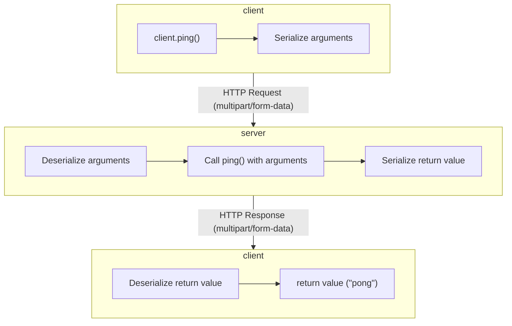

# How It Works

`@slicemachine/rpc` uses the following flow to process procedures over the network.



The server contains all of the procedures and runtime logic.

The client is mostly a wrapper around `fetch` with serialization and deserialization code.

## Serialization format

`@slicemachine/rpc` supports the following types of data:

- Any data supported by [`devalue`][devalue]
- Binary (images, audio, video, etc.)
- Nested objects

`@slicemachine/rpc` uses [`FormData`][mdn-formdata] as its serialization format. `FormData` supports binary data (via [`Blob`][mdn-blob]) and strings.

Non-binary data is serialized before being added to `FormData` using `devalue`. Numbers, `undefined`, `null`, objects, arrays, and more are supported using `devalue`.

`FormData` is a single-level key-value serialization format which does not support nested objects. Data is flattened in transit and unflattened when received using a modified version of [`nest-deep`][nest-deep].

## Errors

Thrown procedure errors are caught and serialized using a special `errors` return value. The error is detected on the client and re-thrown.

Because `Error`s can contain arbirtary data which may not be serializable, only the following properties are preserved across the network:

- `name`
- `message`
- `stack` (only in development)

Properties like `cause` or ones stored in custom errors are ignored.

## TypeScript

Middleware produced by `createRPCMiddleware()` holds a type reference to its procedures.

```typescript
function createRPCMiddleware<TProcedures extends Procedures>(
	args: CreateRPCRouterArgs<TProcedures>,
): RPCMiddleware<TProcedures>;
```

The type reference can be reused in its client.

```typescript
function createRPCClient<TProcedures extends Procedures>(
	args: CreateRPCClientArgs,
): RPCClient<TProcedures>;
```

With that reference, every procedure is properly typed without additional runtime validation. If a type error occurs, your build should fail.

### Adjusting procedure types to handle network limitations

Procedure types need to be modified slightly to support binary data. `Buffer`s are used to represent binary data on the server, while `Blob`s are used on the client. Types are automatically converted in both the server and client appropriately.

### Working with arbitrarily nested types

`@slicemachine/rpc` supports nested data and procedures through liberal use of recursive types.

For example, the following type is used to transform procedure arguments:

```typescript
type TransformProcedureArgs<TArgs> = TArgs extends
	| Record<string, unknown>
	| unknown[]
	? {
			[P in keyof TArgs]: TransformProcedureArgs<TArgs[P]>;
	  }
	: TArgs extends Buffer
	? Blob
	: TArgs;
```

This type accepts arguments via the `TArgs` type parameter and transforms them based on their type:

- **Objects and arrays**: Iterate over each property or element and transform it with `TransformProcedureArgs` again
- **Buffers**: Convert to `Blob`
- Anything else is left as is.

If other transformations are needed, they can be added with new conditions.

[mdn-formdata]: http://developer.mozilla.org/en-US/docs/Web/API/FormData
[mdn-blob]: http://developer.mozilla.org/en-US/docs/Web/API/Blob
[devalue]: https://github.com/Rich-Harris/devalue
[nest-deep]: https://github.com/borm/nest-deep
